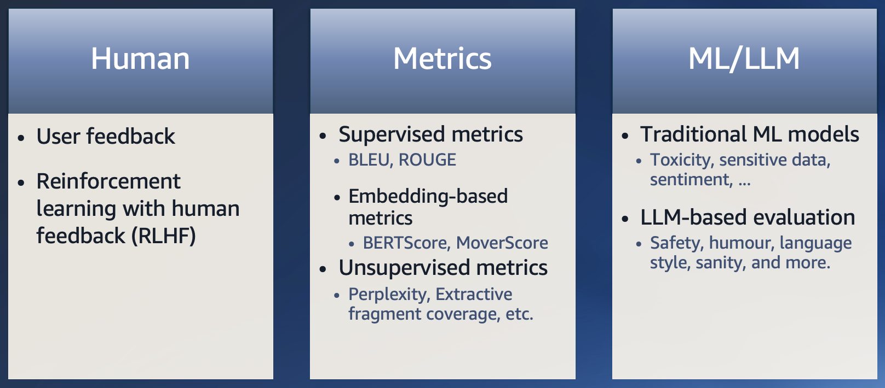
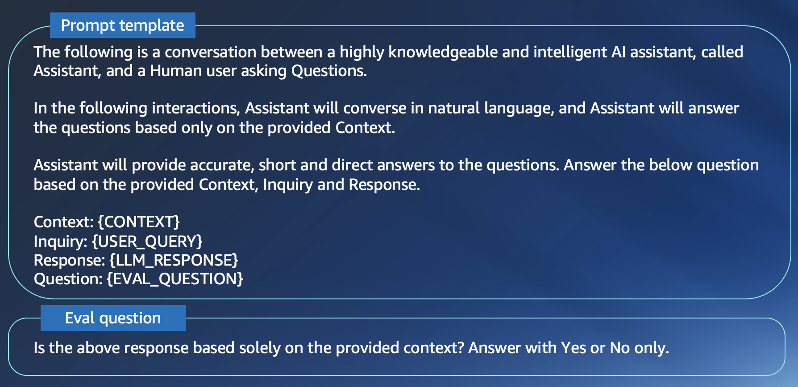
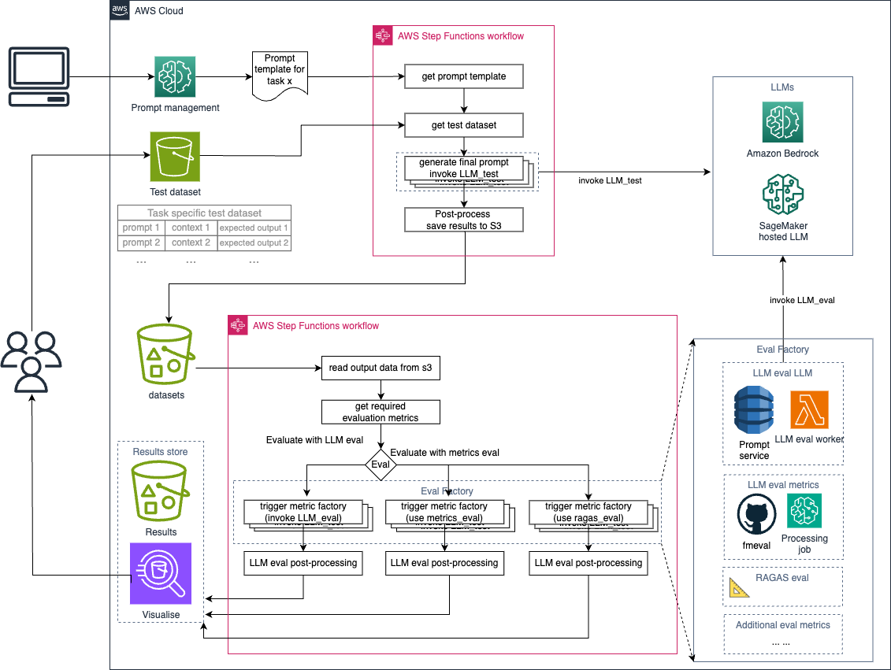
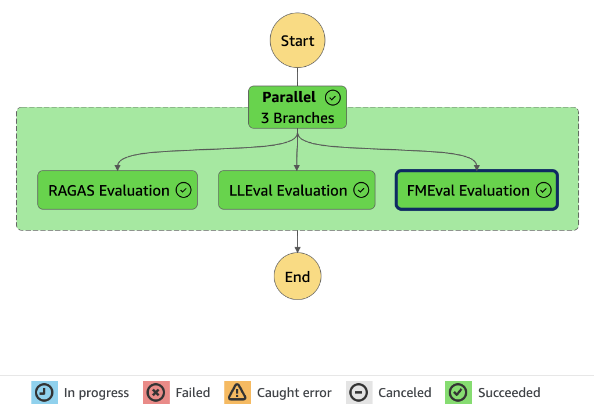
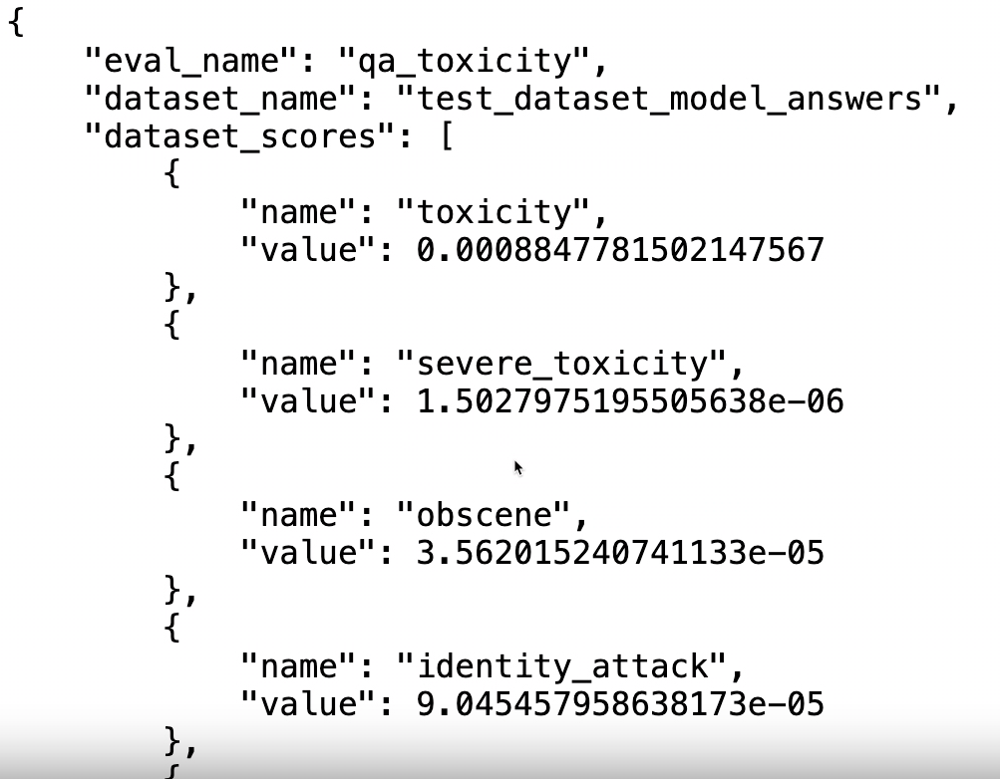
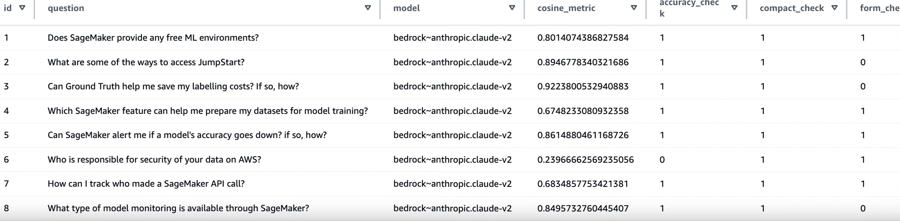

# Large Language model and prompt evaluation
This GitHub repo provides a Large Langurage Model (LLM) evaluation solution leveraging the [Foundation Model Evaluations (FMeval)](https://github.com/aws/fmeval) library provided by AWS. This solution also uses LLM to evaluate other LLMs. 

## Introduction
Generative AI models are incredibly powerful, can generate information about a wide range of topics and perform a wide variety of task. However, they do not always get things right. Building applications with Generative AI can bring additional challenges, such as avoiding topics that are undesirable or irrelevant in the context of your application, avoiding toxic and harmful content and adhere to the safety standards set by your organisation, preventing bias and avoiding propagation of steroteyps, and more. Evaluating LLMs is a complicated and time-consuming task due to the large number of available LLMs as well as the lacking of proper tools to use. 

Evaluating LLMs is a task used to measure the quality of output of an LLM or Generative AI service. The evaluation is not only applied to assessing the pre-trained LLMs, but also after they are customized with domain specific knowledge. It can also involve evaluating the performance of the prompt template designed for a selected LLM for a specific task or the overall performance of the GenAI application. There are different ways and metrics used to evaluate LLMs, some resources can be found here [\[1\]](https://eugeneyan.com/writing/llm-patterns/#evals-to-measure-performance), [\[2\]](https://www.airtrain.ai/blog/the-comprehensive-guide-to-llm-evaluation), and [\[3\]](https://github.com/tjunlp-lab/Awesome-LLMs-Evaluation-Papers) (See below image).

- Human evaluation is the most costly and least scalable method, but can yield solid results. Essentially, if you want to best evaluate the performance and relevance of a model in the context of a specific application, it is important to have human evaluators to review the outputs generated by LLMs. 
- In traditional machine learning, people can use clear metrics like Precision and Recall to measure the classification models. However, language models generate natural language, which is unstructured, making it more challenging to evaluate. There are various metrics available to gauge specific aspects of language model performance, yet there isn't a universal metric that captures overall effectiveness. Some commonly used metrics are BLEU, ROUGE, which are precision and recall oriented metrics and the embedding-based metrics, such as BERTScore and MoverScore. Although it is easy to compute these metrics, however, there’s poor correlation between these metrics and human judgments. Also, these metrics often have poor adaptability to a wider variety of tasks.
- As the LLMs’ outputs are generally in the format of natural languages, people can also use the pretrained machine learning models to perform evaluation. Such as using a pretrained NLP model to predict toxicity.
- Beyond conventional evals such as those mentioned above, an emerging trend is to use a strong LLM as a reference-free metric to evaluate performance of other LLMs. You provide the evaluator LLM with a prompt template that includes criteria for judging the quality of text generated by a candidate LLM. This approach can involve classification tasks where the evaluator LLM categorizes the responses based on a scoring rubric, or binary classification tasks, where it answers yes or no questions about specific characteristics, like the presence of hate speech.

Here is an example prompt template and evaluation question. You can design the prompt template and questions based on your own use cases.

Overall, LLM-guided evaluation offers a quick, sensitive way to assess text generation quality. But it needs to be applied with caution as the scoring model itself is subject to stochastic variations, which can introduce variance in the evaluation results.

## Architecture
AWS provides us with wide range of services that we can use to build a solution that can help automate LLM evaluation on the Cloud. For this solution, our design philosophy is to use multiple modular reusable and scalable components. So that businesses who want to deploy this solution can use some of its components for other Generative AI projects. We came to such decision after recognising a recurring pattern in Generative AI applications. We also put flexibility as one of the core concepts in this solution, making sure it is able to use wide range of existing LLMs and add new LLMs as they come from various providers like SageMaker, Bedrock or others with no to minimal code changes. Typically adding new LLMs can be done on runtime without having to re-deploy any component. To read more about the LLM design pattern, you can refer to this Github repo: [genai-playground-common-design-pattern](https://github.com/aws-samples/genai-playground-common-design-patterns).

Below is the solution architecture diagram of this LLM auto eval pipeline solution.

Some of the key components are detailed as below:

- **LLM service**: This component is responsible for invoking LLMs. In theory, it can handle any LLM regardless of the provider. It also unifies the request and response format. This way, a data scientist for example, does not need to know what specific format an LLM requires to invoke it. Amazon Bedrock can be seen as an easy to implement LLM service, as it provide the [Converse API](https://docs.aws.amazon.com/bedrock/latest/userguide/conversation-inference.html) that provides a consistent API, which works with all Amazon Bedrock models that support messages.
- **Prompt Service**: This Prompt service is used to store LLM prompt templates for various LLM agents. It is useful to control versioning and have ability to include template parameters that can be supplied at runtime making it suitable for various tasks. In this example, we are using the [Bedrock prompt management](https://aws.amazon.com/bedrock/prompt-management/) service.
- **LLM Invocation workflow**: Using Amazon Step function, we define a workflow that starts by formulating a prompt from our test dataset. Then invoking each record and saving results to s3.
- **LLM evaluation workflow**: Also using Amazon Step function, we define a workflow that starts by pulling the results from the previous workflow. Then evaluating each result based on the requested evaluation metrics.
- **Eval Factory**: It is a service that is responsible to evaluate LLM generation. It handles different methods of evaluation from using LLM to evaluation LLMs or using pre-defined LLM eval metrics. You can continously add new eval metrics/frameworks as a new branch in the step function as the GenAI use case evolves.
- **Result store**: This is an optional component that you can add to show the results. It can use a visualization dashboard or simply use S3 to store raw output. In this example, we use Athena to visualise the eval results stored on S3.

We have separated the LLM invocation and LLM evaluation to two workflows, this provides the flexibility to the users that they can choose to just perform batch LLM invocation or LLM evaluaiton with existing LLM generated outputs. 

### Prerequisites
To get started with the solution, we have provided a setup tool to help configure the necessary components. Please ensure you have the following prerequisites in place before running the setup tool:

- AWS CLI with AWS credentials
- SAM CLI 
- Docker or other equivalent container runtime CLI

### Execution steps:

- Step 1: After cloning the Git repo into your development environment. Open a Terminal session and execute the [setup.sh](https://github.com/aws-samples/build-an-automated-large-langurage-model-evaluation-pipeline-on-aws/blob/main/infrastructure/setup.sh) script in the `infrastructure` folder. The setup script will deploy the invocation and evaluation pipelines. It handles the end-to-end configuration so you can focus on using the pipelines. This may take up to 10 minutes to deploy the full solution.

- Step 2: Go to the AWS Step Functions console, you can find a state machine called "Invoke-LLM". This step function parses your input questions, calls the LLM endpoint to get the results, and prepares output for evaluation. Before running the invocation pipeline, we need to prepare a pipe-delimited CSV file with the below columns. In this example, we use 50 questions related to Amazon SageMaker as the dataset that can be found under the `evaluation_artifacts` folder. Upload the csv file to an S3 buicket and note the location
  - A unique ID for each question 
  -	The question texts
  -	relevant question context  
  -	The expected answer
- Step 3: Then kick off the Invoke-LLM step functions execution, providing the below payload: 
  - The “invoke model family”, we use bedrock for this demo
  - The “invoke model name” you want to evaluate. In this demo we will evaluate “Anthropic Claude v1”
  - question_bucket: S3 bucket where the question csv file is uploaded
  - question_key: the S3 Object key for the CSV file

The Invoke-LLM step function will 
   > Get the questions csv file from S3
> 
   > Parse the content into individual questions
> 
   > Invoke the LLM for each question simultaneously using a Step Functions’ Map flow
> 
   > Retry up to twice for any errors or throttling
> 
   > Aggregate the outputs into a JSONL file for evaluation

You can prepare this JSONL file using other ways as well, as long as it matches the SageMaker Processing job input format. The S3 location of the evaluation artifacts including id, questions text, context, expected answers, and generated answers. 

- Step 4: Go to the AWS Step Functions console and find the pipeline line called evaluate-LLM, the pipeline can be triggered by submitting the input payload:
  - S3 location of the evaluation artifacts
  - The “evaluation_model_family”, in our example, we use bedrock
  - The “evaluation_model_name”. The judge LLM name, we will use Anthropic Claude v2 as an example
  - Instance type - the SageMaker processing job instance type you are going to run with
 
The pipeline execution has two parallel branches: 
> -	The MetricsEval branch uses the opensource FMEval library to compute metrics like Factual accuracy, QAAccuracy, and Toxicity. This branch uses a Map state with one execution for a SageMaker processing job per metric across all questions.
> -	The LLMEval branch uses the LLM as a judge to evaluate metrics like answer cosine similarity, redundancy, and compactness, etc. This uses a Step Functions Map to process each question and compute its metrics.

The pipeline may take a few minutes or more depending on the number of evaluation questions. For the SageMaker processing job’s evaluation output, the outputs are saved to S3 as json file. For the customized LLM evaluation branch, the output is saved as s3 objects as well as an Athena table. Below are the example results for the two branches.

LLM eval results using fmeval library and SageMaker processing job:

LLM eval results using LLM to evaluate LLM outputs:

## Security

See [CONTRIBUTING](CONTRIBUTING.md#security-issue-notifications) for more information.

## License

This library is licensed under the MIT-0 License. See the LICENSE file.
